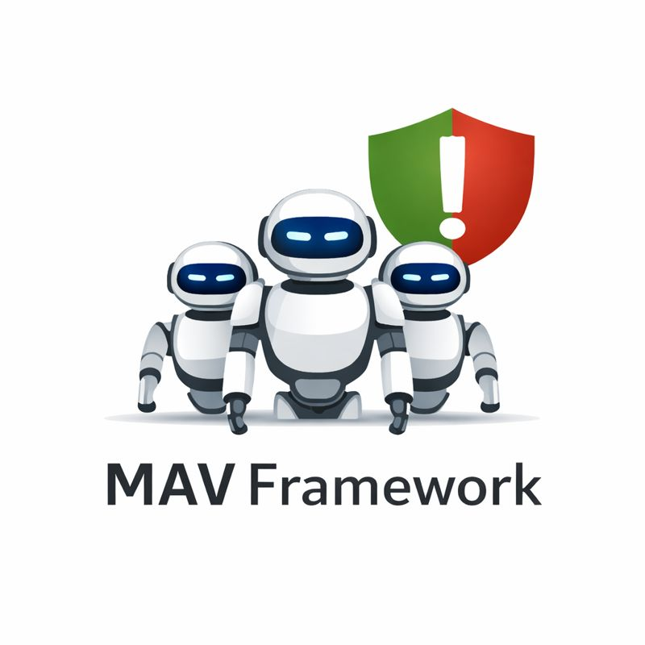

<h1 align="center">
    🤖 MAV Framework
</h1>
<p align="center">
    <p align="center">Multi-Agent Vulnerable Framework - Testing multi-agent systems against security vulnerabilities and attack vectors
    </p>
</p>

<h4 align="center">
    <a href="https://arxiv.org/abs/2510.07505" target="_blank">
        
    </a>
</h4>

<p align="center">
    
</p>

## Prerequisites

Make sure Python version 3.12 is installed in your virtual or conda environment, then:

```bash
pip install -r requirements.txt
```

## Repository Structure

```
multiagent-vulnerable/
├── examples/                          # Example scripts and notebooks
├── experiments/                       # Experiment scripts for benchmarking
├── getting_started/                   # Detailed guides and tutorials
├── requirements.txt                   # Python dependencies
├── pyproject.toml                     # Project configuration
└── src/mav/                          # Main source code
    ├── __init__.py
    ├── benchmark.py                   # Benchmarking utilities
    ├── MAS/                          # Multi-Agent System components
    │   ├── framework.py              # Core MAS framework
    │   ├── terminations.py           # Termination conditions
    │   └── agents/                   # Agent implementations
    │       ├── agent.py              # Base agent class
    │       ├── guardrail.py          # Guardrail mechanisms
    │       ├── session.py            # Session management
    │       ├── tool.py               # Tool definitions
    │       └── run.py                # Agent execution logic
    └── Tasks/                        # Task definitions and environments
        ├── base_environment.py       # Base environment class
        ├── base_tasks.py             # Base task classes (BaseUserTask, BaseAttackTask)
        ├── load_task_suites.py       # Task suite loading utilities
        ├── task_combinator.py        # Task combination utilities
        ├── task_suite.py             # Core task suite implementation
        ├── banking/                  # Banking domain tasks
        │   ├── environment.py        # Banking environment
        │   ├── task_suite.py         # Banking task suite
        │   ├── tools.py              # Banking tools
        │   ├── user_tasks.py         # User tasks
        │   ├── attack_tasks/         # Attack task implementations
        │   └── data/                 # Environment data and configs
        ├── python_exec/              # Python execution domain tasks
        ├── slack/                    # Slack domain tasks
        ├── travel/                   # Travel domain tasks
        ├── workspace/                # Workspace domain tasks
        └── utils/                    # Task utilities
            ├── checkpoints.py        # Checkpoint management
            ├── task_loader.py        # Task loading utilities
            └── yaml_loader.py        # YAML loading utilities
```

## Core Architecture

### Tasks
Our pre-built task suites, each containing a variety of tasks for benchmarking

### Multi-Agent System (MAS)
- **MultiAgentSystem**: Core framework for running multi-agent workflows
- **Agent**: A complete, readable, configurable, clean, and attackable agent framework
---

## Getting Started

Please check the `getting_started` folder, which contains detailed guides (Jupyter notebooks) that walk through all core components of the framework. You can benchmark different MAS workflows and agents on our pre-built task suites or add your own task suite to benchmark.

## Contributing

When adding new tasks or attacks:
1. Follow the established patterns and naming conventions
2. Include comprehensive documentation and comments
3. Test your implementations thoroughly
4. Consider security implications and ethical boundaries
5. Update this README if adding new concepts or patterns
